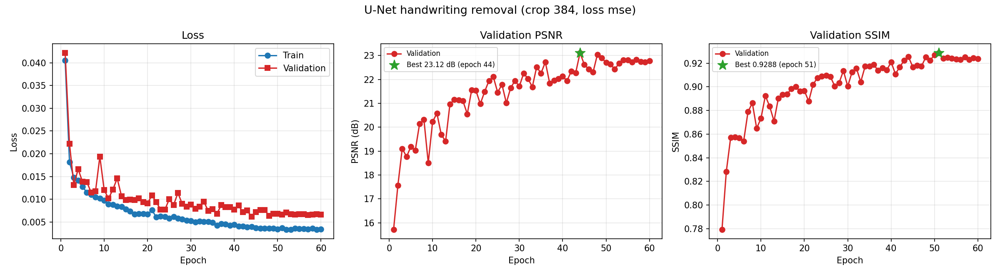
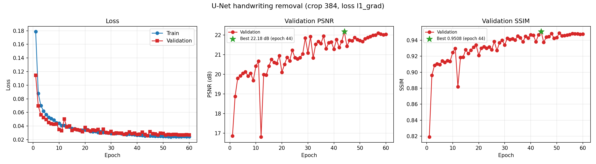
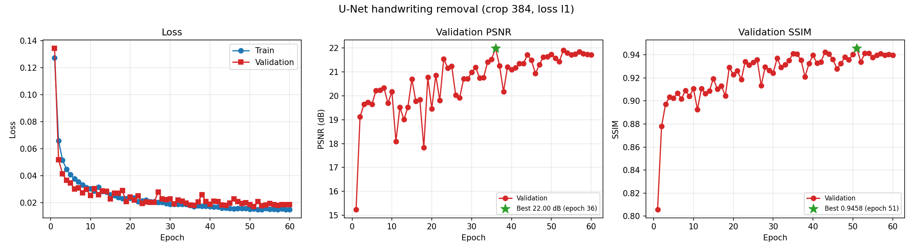
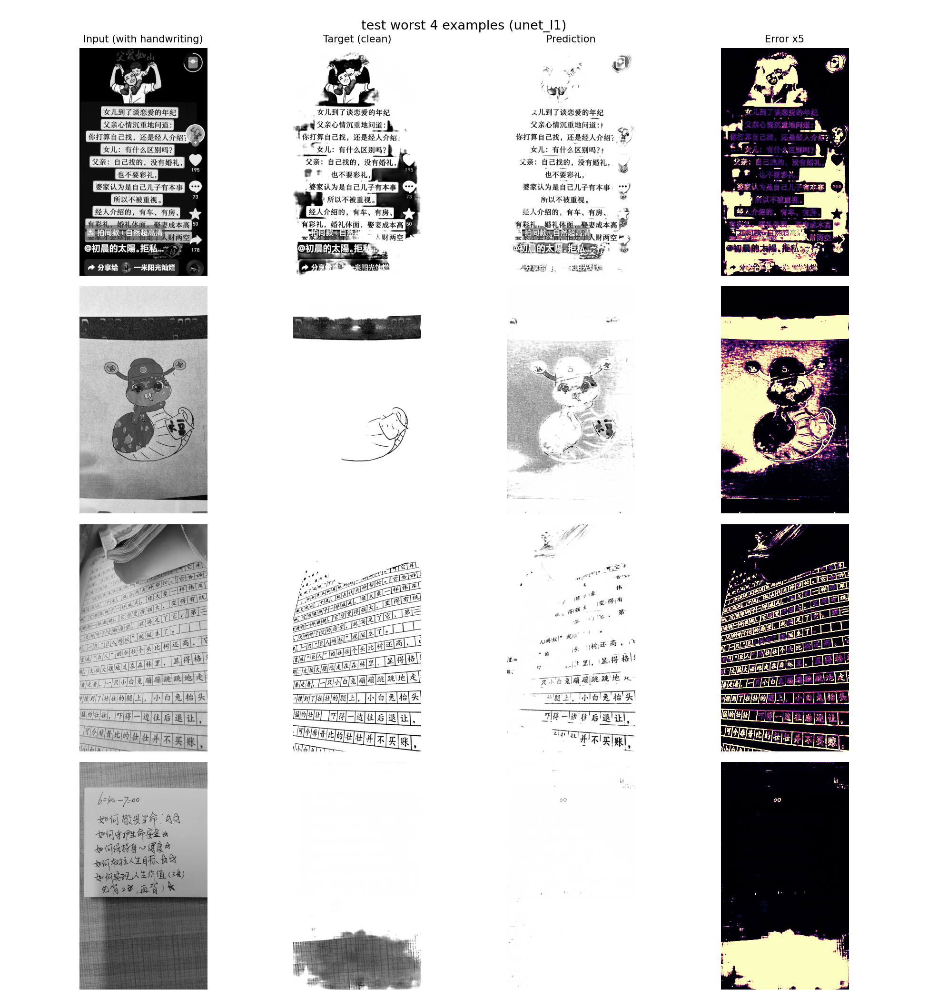
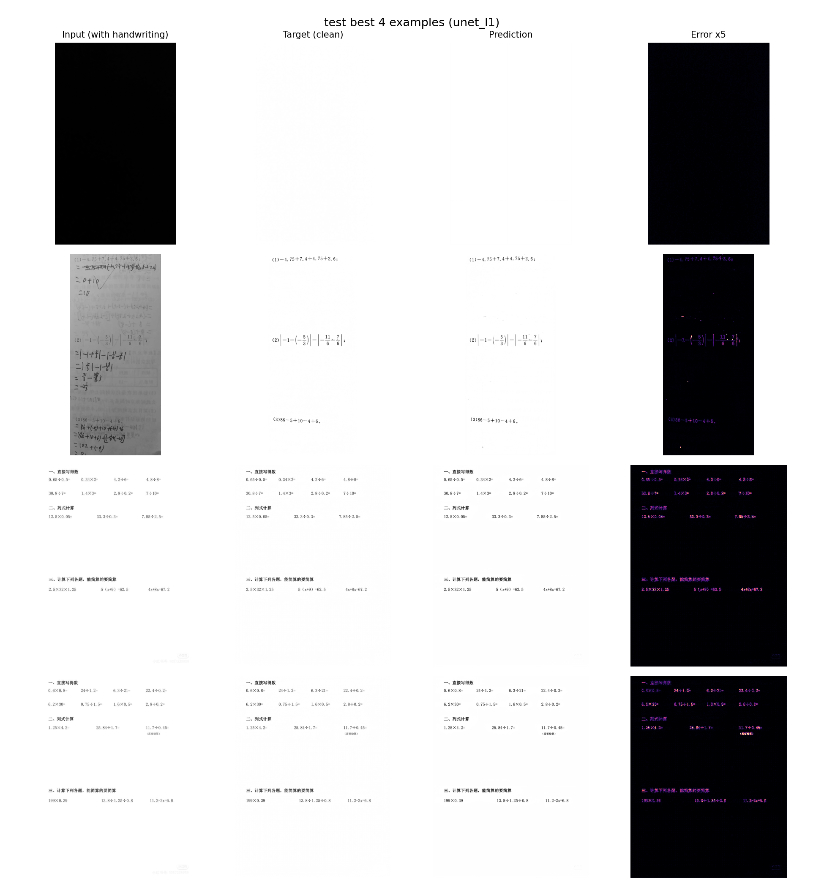
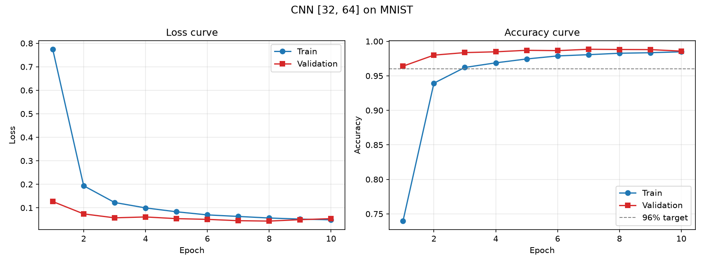
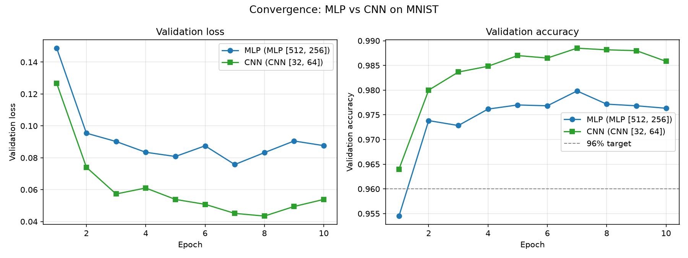
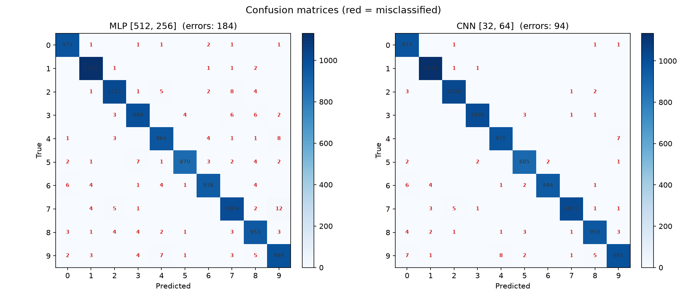
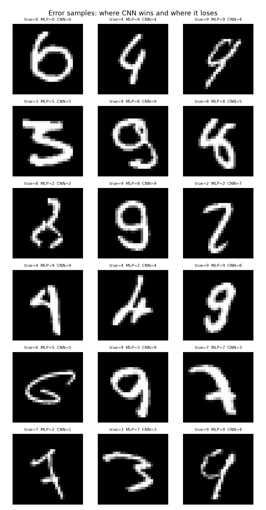
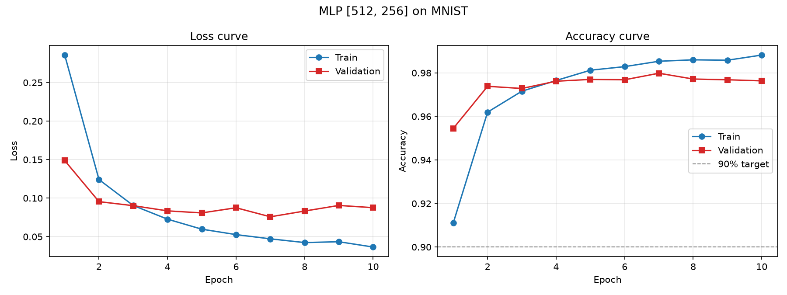

# 实验记录

每次实验至少记录以下 15 项，按时间从上往下追加，最新的实验放在最上面。模板见文末。

---

## 实验 05 ｜ 2026-09-24 ｜ Level 4：损失函数对照（L1 / MSE / L1+梯度）

在实验 04 的基础上补做损失函数对照。三组训练的超参数、数据划分、随机种子完全一致，
只有 `--loss` 不同，因此指标差异可以归因到损失函数本身。

| 字段 | 值 |
|---|---|
| 实验编号与日期 | 05 / 2026-09-24 10:47 ~ 12:07 |
| Git commit ID | `3eeddd8`（engine.py 的 samples 命名有后续改动） |
| 模型名称 | U-Net base_channels=64 depth=4（三组相同） |
| 数据集和划分方式 | 与实验 04 相同：train = 20250211+20250212（1712 对），val = 20250213 前 10%（70 对），test = 其余（630 对） |
| 随机种子 | 42 |
| 输入尺寸 | 原分辨率随机裁剪 384×384（训练），整图分块（测试，`--tile 512`） |
| batch size | 16（drop_last） |
| optimizer / learning rate / epoch | AdamW / 2e-4（weight_decay 1e-5），余弦退火 / 60 epochs |
| 损失函数 | 三组分别为 L1、MSE、L1+梯度（梯度项权重 0.5），梯度裁剪 1.0 |
| 参数量 | 31,036,481 |
| 测试 PSNR / SSIM | L1 23.74 dB / 0.9584；MSE 24.86 dB / 0.9493；L1+梯度 24.31 dB / 0.9620 |
| 验证 PSNR / SSIM（最优） | L1 22.00 / 0.9409（第 36 轮）；MSE 23.12 / 0.9255（第 44 轮）；L1+梯度 22.18 / 0.9508（第 44 轮） |
| 训练时长 | L1 2342.5 s；MSE 2345.9 s；L1+梯度 2354.7 s，合计 7043 s（1.96 小时） |
| GPU 显存占用 | 峰值 13300.8 / 13307.8 / 13300.8 MB |
| 结果图路径 | `reports/figures/unet_{l1,mse,l1grad}_curves.png`、对应 `_test_worst.png` / `_test_best.png`、`reports/samples/unet_*_samples.png` |

补充信息：

- 六个测试集指标里最差/最好：L1 8.66 / 54.52 dB、MSE 9.51 / 43.41 dB、L1+梯度 8.83 / 54.96 dB；SSIM 最差分别为 0.5225 / 0.4213 / 0.5462
- 全白/全黑检查：三组各 60 轮验证均为 0 次退化；test 各有 1 张触发阈值，三次都是同一张（7289605764196397056），该张真值 std 仅 0.0017，本身即空白页，不属于退化失败
- 泛化差距：验证 → 测试分别为 22.00→23.74、23.12→24.86、22.18→24.31 dB，三次测试都优于验证，按日期留出的协议下没有过拟合迹象
- 本组实验的服务器目录在取回产物后整体删除，权重与数据集未长期留存
- 完整指标与逐轮 history：`reports/metrics/unet_{l1,mse,l1grad}.json` 及其 `_test.json`





### 结论和下一步修改

1. SSIM 排序为 L1+梯度 > L1 > MSE，与预期一致：MSE 优化的条件均值让笔迹边缘留灰影，结构相似度吃亏；梯度项直接约束 `|∇pred − ∇target|`，边缘保真度最好。
2. PSNR 排序为 MSE > L1+梯度 > L1，其中 MSE 最高符合预期（PSNR 就是 MSE 的对数变换），但 L1 垫底不符合预期 —— 原本估计梯度项会牺牲一点像素精度，实测加上边缘约束后像素误差也一起下降了。
3. 差距幅度很小（PSNR 最大差 1.12 dB，SSIM 最大差 0.0127），且是单次运行、没有多种子，不能据此断言某个损失更优。交付仍以默认的 L1 为主实验。
4. 下一步：若要下结论至少需要 3 个种子的重复，或把评估换成可导 SSIM / 感知损失等与人眼更一致的度量。

---

## 实验 04 ｜ 2026-09-24 ｜ Level 4：U-Net 手写内容擦除

在远端 AutoDL 服务器（RTX 4090D）上训练，本机不参与训练。数据按日期留出。

| 字段 | 值 |
|---|---|
| 实验编号与日期 | 04 / 2026-09-24 00:12 |
| Git commit ID | `15113f0` |
| 模型名称 | U-Net base_channels=64 depth=4（转置卷积上采样） |
| 数据集和划分方式 | 配对文档图 2412 对；train = 20250211+20250212（1712 对），val = 20250213 前 10%（70 对），test = 其余（630 对），按日期留出 |
| 随机种子 | 42 |
| 输入尺寸 | 原分辨率随机裁剪 384×384（训练），整图（验证/测试） |
| batch size | 16（drop_last） |
| optimizer / learning rate / epoch | AdamW / 2e-4（weight_decay 1e-5），余弦退火 / 60 epochs（每 epoch 107 个 step） |
| 损失函数 | L1，梯度裁剪 1.0 |
| 参数量 | 31,036,481 |
| 测试 PSNR / SSIM | 23.74 dB / 0.9584（PSNR 最差 8.66、最好 54.52；SSIM 最差 0.5225、最好 0.9984） |
| 验证 PSNR / SSIM（最优 epoch 36） | 22.00 dB / 0.9409 |
| 训练时长 | 2342.5 s（39.0 分钟） |
| GPU 显存占用 | 峰值 13,300.8 MB |
| 结果图路径 | `reports/figures/unet_l1_curves.png`、`unet_l1_test_worst.png`、`unet_l1_test_best.png` |

补充信息：

- 全白/全黑检查：训练 60 轮验证退化计数始终为 0；test 630 张中 1 张（7289605764196397056）预测近白触发阈值，但该张真值本身就是近空白页（std 0.0017），预测 PSNR 54.52 dB 为全集最高，属正确预测而非退化失败
- 泛化差距：验证 22.00 dB → test 23.74 dB（test 分布略易），无过拟合迹象；train loss 由 0.127 降到 0.015
- 评估首次整图推理在超大图上 OOM，改用 `--tile 512` 分块推理完成
- 损失函数对照见下方实验 05（三组超参完全一致，只改 `--loss`）
- 费用大约30元；环境：Python 3.12.3 / PyTorch 2.5.1+cu124 / RTX 4090D
- 权重文件：`checkpoints/unet_l1_best.pt`（已 gitignore）
- 完整指标与逐轮 history：`reports/metrics/unet_l1.json`、`reports/metrics/unet_l1_test.json`







### 结论和下一步修改

1. 主实验达到全部验收标准：曲线完整、无退化失败（1 张阈值报警经核查为空白页的正确预测）、训练时长 39.0 分钟有记录。
2. test PSNR 23.74 dB / SSIM 0.9584，且 test 优于 val，按日期留出的协议下没有过拟合，数据量是主要瓶颈。
3. 下一步可尝试 README 中列出的方向：pix2pix 式对抗损失提升锐度、感知损失、可微 SSIM 损失，以及 MSE / L1+梯度的对照实验。

---

## 实验 03 ｜ 2026-09-22 ｜ Level 3：AlexNet / ResNet-18 on Fashion-MNIST

本次跑两个模型，超参数完全一致，差异只来自网络结构。

### 3-A：AlexNet

| 字段 | 值 |
|---|---|
| 实验编号与日期 | 03-A / 2026-09-22 23:27 |
| Git commit ID | `3862cd6` |
| 模型名称 | AlexNet (dropout=0.5) |
| 数据集和划分方式 | Fashion-MNIST；官方训练集 60,000 张中切 10% 作验证集 → train 54,000 / val 6,000；测试集用官方 10,000 张 |
| 随机种子 | 42 |
| 输入尺寸 | 1 × 28 × 28 |
| batch size | 128 |
| optimizer / learning rate / epoch | Adam / 1e-3 / 20 epochs（每 epoch 422 个 step） |
| 损失函数 | CrossEntropyLoss |
| 参数量 | 5,338,314 |
| 测试准确率 | 91.42%（测试损失 0.2706） |
| 训练时长 | 143.7 s |
| GPU 显存占用 | 峰值 257.6 MB |
| 结果图路径 | `reports/figures/alexnet_fashionmnist_curves.png` |

### 3-B：ResNet-18

| 字段 | 值 |
|---|---|
| 实验编号与日期 | 03-B / 2026-09-22 23:34 |
| Git commit ID | `3862cd6` |
| 模型名称 | ResNet18 |
| 数据集和划分方式 | Fashion-MNIST；train 54,000 / val 6,000 / test 官方 10,000（与 3-A 相同的划分） |
| 随机种子 | 42 |
| 输入尺寸 | 1 × 28 × 28 |
| batch size | 128 |
| optimizer / learning rate / epoch | Adam / 1e-3 / 20 epochs |
| 损失函数 | CrossEntropyLoss |
| 参数量 | 11,172,810 |
| 测试准确率 | 92.63%（测试损失 0.3767） |
| 训练时长 | 444.4 s |
| GPU 显存占用 | 峰值 659.0 MB |
| 结果图路径 | `reports/figures/resnet_fashionmnist_curves.png` |

补充信息：

- 权重初始化：Kaiming Normal（`nonlinearity="relu"`），偏置置零
- 数据增强：未启用（`--augment` 默认关闭，以保持与 Level 1/2 的输入分布一致）
- 环境：Python 3.11.9 / PyTorch 2.11.0+cu128 / RTX 5060 Laptop GPU
- 权重文件：`checkpoints/alexnet_fashionmnist_best.pt`、`checkpoints/resnet_fashionmnist_best.pt`（均已 gitignore）
- 完整指标与逐轮 history：`reports/metrics/alexnet_fashionmnist.json`、`reports/metrics/resnet_fashionmnist.json`
- 两者对比：`reports/metrics/compare_level3.json`


### 3-C：PlainNet-18（残差消融）

第一次运行时该实验被中途中止，未导出指标；后于 2026-09-23 补跑完成。

| 字段 | 值 |
|---|---|
| 实验编号与日期 | 03-C / 2026-09-23 09:47 |
| Git commit ID | `3862cd6` |
| 模型名称 | PlainNet18 (no residual) |
| 数据集和划分方式 | Fashion-MNIST；train 54,000 / val 6,000 / test 官方 10,000（与 3-A/3-B 相同的划分） |
| 随机种子 | 42 |
| 输入尺寸 | 1 × 28 × 28 |
| batch size | 128 |
| optimizer / learning rate / epoch | Adam / 1e-3 / 20 epochs |
| 损失函数 | CrossEntropyLoss |
| 参数量 | 11,172,810（与 ResNet-18 完全相同） |
| 测试准确率 | 92.76%（测试损失 0.2273） |
| 训练时长 | 439.5 s |
| GPU 显存占用 | 峰值 637.2 MB |
| 结果图路径 | `reports/figures/resnet_plain_curves.png` |

与 3-B 构成干净对照：两者参数量、超参数、数据划分、随机种子全部相同，
唯一差别是有无跨层连接（`residual=True / False`，加法不引入参数）。


### 横向对比

| 指标 | AlexNet | ResNet-18 | PlainNet-18 |
|---|---|---|---|
| 参数量 | 5,338,314 | 11,172,810（2.09 倍） | 11,172,810 |
| 测试准确率 | 91.42% | 92.63% | **92.76%** |
| 测试损失 | 0.2706 | 0.3767 | **0.2273** |
| 最优 epoch / 验证准确率 | 第 14 轮 / 91.98% | 第 19 轮 / 93.30% | 第 9 轮 / 92.95% |
| 第 1 轮验证准确率 | 86.53% | 89.12% | 87.03% |
| 达到 92% 验证准确率 | 未达到 | 第 4 轮 | 第 6 轮 |
| 每轮平均耗时 | 7.2 s | 22.2 s | 22.0 s |
| 训练总时长 | 143.7 s | 444.4 s | 439.5 s |
| GPU 显存峰值 | 257.6 MB | 659.0 MB | 637.2 MB |
| 第 20 轮训练准确率 | 95.60% | 99.46% | 99.15% |
| 训练/验证准确率差距 | 3.62 个百分点 | 6.16 个百分点 | 6.20 个百分点 |

### 结论和下一步修改

**结论**

1. ResNet-18 用 2.09 倍参数量换来 1.21 个百分点的测试准确率提升（92.63% vs 91.42%），
   但每轮耗时增加到 3.1 倍，性价比并不突出。
2. 收敛速度上 ResNet-18 领先：第 4 轮验证准确率就达到 92.53%，AlexNet 全程 20 轮
   最高只到 91.98%，差 0.02 个百分点未能越过 92%。但要注意这里**不能**把差距简单归因于
   残差连接——ResNet 与 AlexNet 同时在卷积核尺寸、BatchNorm、分类头结构（全局平均池化
   替代大全连接层）、Dropout 上都不同，属于多变量混杂的比较，无法分离出单一因素。
3. **残差消融给出了与预期相反的结果**（3-B vs 3-C）：两者参数量完全相同（11,172,810），
   去掉跨层连接后测试准确率不降反升（92.76% vs 92.63%），测试损失明显更低
   （0.2273 vs 0.3767），到达最优还更早（第 9 轮 vs 第 19 轮）。
   本次实验**没有复现出残差连接的优势**。
   推测原因（均未经进一步实验验证）：18 层对 28×28 的输入还不够深，原论文中的网络退化
   现象出现在 34 层以上；BatchNorm 已承担了稳定梯度尺度的主要工作；
   两个模型都严重过拟合，比较被正则化效应主导；以及单次运行的差异可能落在噪声内。
4. 三个模型都严重过拟合。ResNet-18 第 20 轮训练准确率 99.46%、验证准确率最高 93.30%，
   相差 6.16 个百分点；验证损失从第 4 轮的 0.1997 一路回升到第 20 轮的 0.3741，
   而训练损失同期从 0.1504 降到 0.0166。1117 万参数对 54,000 张训练图而言过多。
5. 本次未启用数据增强，这是过拟合的原因之一 —— 但保持关闭的理由是让 Level 3 与
   Level 1/2 的输入分布一致，跨 Level 的可比性优先。

**下一步修改**

1. **验证残差消融的结论**：当前只有 seed 42 的单次运行，0.13 个百分点的差距不足以
   声称有统计显著性。需要多组随机种子重复取均值；若要考察残差连接真正的价值，
   应把深度加到 34/50 层让退化问题出现，或换用更难的 CIFAR-10。
2. **抑制过拟合**：可尝试 `--augment`（随机裁剪 padding=2）或提高 weight_decay
   （当前为 0），观察验证损失回升是否被推迟。
3. **缩减 ResNet 规模**：针对 28×28 的小图，ResNet-18 的 4 个 stage 偏深，
   可考虑减少 stage 数或通道数，在精度基本不变的前提下降低参数量与训练成本。
4. Level 3 的实践任务（AlexNet、ResNet）已完成；VGG 未按验收标准单独实现，
   仅在 README 的演进主线中说明，这点需在文档中明确以免被误认为遗漏。

---

## 实验 02 ｜ 2026-09-22 ｜ Level 2：CNN on MNIST + 与 MLP 四角度对比

| 字段 | 值 |
|---|---|
| 实验编号与日期 | 02 / 2026-09-22 23:23 |
| Git commit ID | `3862cd6` |
| 模型名称 | CNN [32, 64] conv / fc_hidden = 32 |
| 数据集和划分方式 | MNIST；官方训练集 60,000 张中切 10% 作验证集 → train 54,000 / val 6,000；测试集用官方 10,000 张 |
| 随机种子 | 42 |
| 输入尺寸 | 1 × 28 × 28（不展平，保持二维送入卷积） |
| batch size | 128 |
| optimizer / learning rate / epoch | Adam / 1e-3 / 10 epochs（每 epoch 422 个 step） |
| 损失函数 | CrossEntropyLoss |
| 参数量 | 119,530 |
| 测试准确率 | **99.06%**（测试损失 0.0323，错误 94 张） |
| 训练时长 | 35.58 s |
| GPU 显存占用 | 峰值 78.7 MB |
| 结果图路径 | `reports/figures/cnn_mnist_curves.png` |

补充信息：

- dropout = 0.2，weight_decay = 0，与 Level 1 的超参数刻意保持一致，差异只来自网络结构
- 权重初始化：Kaiming Normal（`nonlinearity="relu"`），偏置置零
- 最优 epoch = 第 7 轮，该轮验证准确率 98.85%；第 10 轮训练准确率 98.48%
- 环境：Python 3.11.9 / PyTorch 2.11.0+cu128 / RTX 5060 Laptop GPU
- 权重文件：`checkpoints/cnn_mnist_best.pt`（已 gitignore）
- 完整指标与逐轮 history：`reports/metrics/cnn_mnist.json`
- 对比数据：`reports/metrics/compare_mlp_cnn.json`



### 与 MLP 的四角度对比

`level2_cnn/src/compare.py` 一次跑出全部数字：

| 角度 | 指标 | MLP [512, 256] | CNN [32, 64] |
|---|---|---|---|
| 参数量 | 可训练参数 | 535,818 | 119,530（MLP 的 22.3%） |
| 准确率 | 测试集准确率 | 98.16%（错 184 张） | **99.06%**（错 94 张） |
| 收敛速度 | 第 1 轮验证准确率 | 95.45% | 96.40% |
| 收敛速度 | 达到 96% 所需 epoch | 第 2 轮 | 第 1 轮 |
| 收敛速度 | 每轮平均耗时 | 3.8 s | 3.6 s |
| 收敛速度 | 最优 epoch / 验证准确率 | 第 7 轮 / 97.98% | 第 7 轮 / 98.85% |
| 错误样本 | 两者都错 | 48 张 | （同左） |
| 错误样本 | 只有 MLP 错 | 136 张 | — |
| 错误样本 | 只有 CNN 错 | — | 46 张 |

易混淆的数字对（真实 → 预测，取前 5）：

- MLP：`7→9`（12）、`2→7`（8）、`4→9`（8）、`5→3`（7）、`9→4`（7）
- CNN：`9→4`（8）、`4→9`（7）、`9→0`（7）、`6→0`（6）、`7→2`（5）







### 结论和下一步修改

**结论**

1. CNN 用 22.3% 的参数量把测试准确率从 98.16% 提到 99.06%，提升 0.90 个百分点、少错 90 张，
   达到验收标准「CNN 测试集准确率约 96%」。
2. 收敛更快：CNN 第 1 轮验证准确率就有 96.40%，MLP 要到第 2 轮才越过 96%。
   但每轮耗时几乎相同（3.6 s vs 3.8 s）—— MNIST 规模太小，两个模型都跑不满 GPU，
   瓶颈不在计算量上，参数量少并不直接换来更短的每轮时间。
3. 错误样本给出了提升来源的直接证据：只有 MLP 错的 136 张 vs 只有 CNN 错的 46 张，
   CNN 净多救回 90 张；48 张两者都错的是共同硬样本。
4. 两者最易混淆的类别对都集中在字形相近的数字（7/9、4/9）上，
   这类错误更多来自书写本身的歧义，换网络结构改善有限。

**下一步修改**

1. 进入 Level 3，在更难的 Fashion-MNIST 上对比 AlexNet 与 ResNet，
   观察在 MNIST 上被抹平的网络结构差异是否重新显现。
2. MNIST 已接近饱和（99.06%），继续在该数据集上调参收益很低，不再投入。

---

## 实验 01 ｜ 2026-09-17 ｜ Level 1：MLP on MNIST

| 字段 | 值 |
|---|---|
| 实验编号与日期 | 01 / 2026-09-17 23:46 |
| Git commit ID | `871020a` |
| 模型名称 | MLP [512, 256] |
| 数据集和划分方式 | MNIST；官方训练集 60,000 张中切 10% 作验证集 → train 54,000 / val 6,000；测试集用官方 10,000 张 |
| 随机种子 | 42 |
| 输入尺寸 | 1 × 28 × 28（展平为 784） |
| batch size | 128 |
| optimizer / learning rate / epoch | Adam / 1e-3 / 10 epochs（每 epoch 422 个 step） |
| 损失函数 | CrossEntropyLoss |
| 参数量 | 535,818 |
| 测试准确率 | **98.16%**（测试损失 0.0672） |
| 训练时长 | 37.58 s |
| GPU 显存占用 | 峰值 28.9 MB |
| 结果图路径 | `reports/figures/mlp_mnist_curves.png` |

补充信息：

- dropout = 0.2，weight_decay = 0（未启用 L2 正则）
- 权重初始化：Kaiming Normal（`nonlinearity="relu"`），偏置置零
- 最优 epoch = 第 7 轮，该轮验证准确率 97.98%；第 10 轮训练准确率 98.82%
- 环境：Python 3.11.9 / PyTorch 2.11.0+cu128 / RTX 5060 Laptop GPU
- 权重文件：`checkpoints/mlp_mnist_best.pt`（已 gitignore）
- 完整指标与逐轮 history：`reports/metrics/mlp_mnist.json`



### 结论和下一步修改

**结论**

1. 测试准确率 98.16%，超过 90% 的验收标准。训练准确率第 1 轮就有 91.1%，说明 MNIST 对 MLP 而言并不难。
2. 出现过拟合迹象：训练准确率持续上升到 98.8%，但验证准确率第 7 轮后不再提升；验证损失从第 5 轮的 0.0808 回升到第 10 轮的 0.0905。由于训练脚本按验证准确率保存最优权重，最终使用的是第 7 轮的模型。
3. 参数量 535,818，其中第一层 `Linear(784, 512)` 占 401,920（75%）—— 瓶颈来自「把图像展平成一维」这一步。

**下一步修改**

1. 进入 Level 2，换 CNN 做对照实验，重点比较参数量与收敛速度：卷积的局部连接和权值共享有望用远少于 53.6 万的参数达到更高准确率。
2. 若继续用 MLP，可尝试加大 dropout（0.2 → 0.3/0.5）或启用 weight_decay，观察验证损失回升是否被推迟。
3. 补充错误样本分析（哪些数字被认错、错在哪些类别之间），为 Level 2 的「错误样本对比」做准备。

---

## 记录模板

复制下面字段填写新实验：

```text
## 实验 NN ｜ YYYY-MM-DD ｜ Level X：<实验名>

- 实验编号与日期
- Git commit ID
- 模型名称
- 数据集和划分方式
- 随机种子
- 输入尺寸
- batch size
- optimizer、learning rate、epoch/step
- 损失函数
- 参数量
- 测试准确率或 PSNR/SSIM
- 训练时长
- GPU 显存占用
- 结果图路径
- 结论和下一步修改
```
