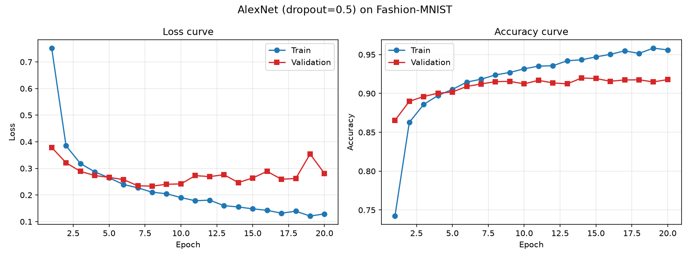
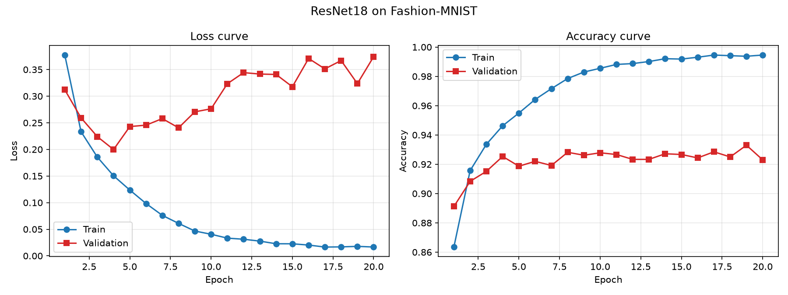
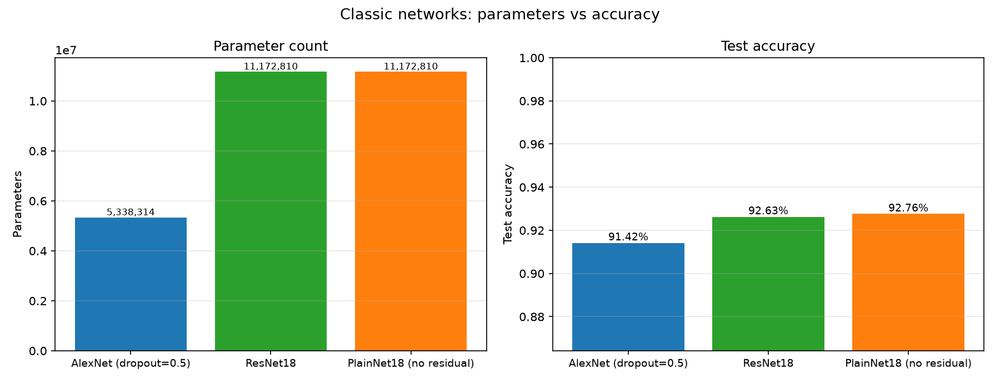
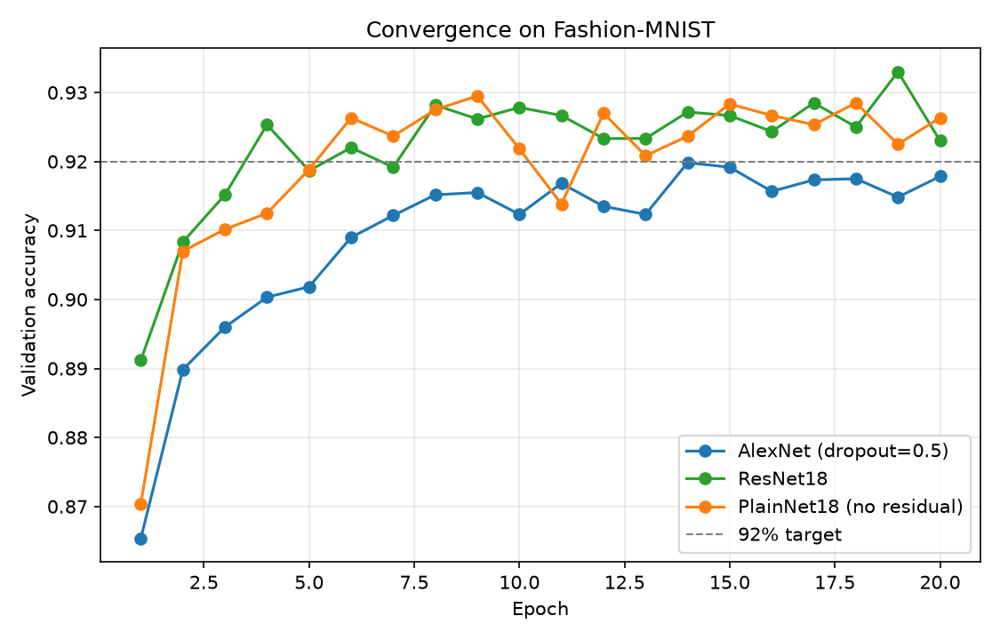
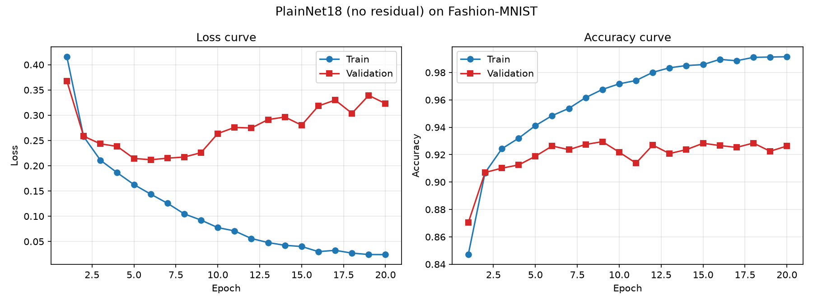

# Level 3：经典网络 AlexNet 与 ResNet

目标：理解 AlexNet → VGG → ResNet 的演进，并分别实现 AlexNet 与 ResNet

验收标准（README.md:17）：在已有代码基础上分别实现 AlexNet、ResNet

## 模块的整合

| 模块 | 内容 |
| --- | --- |
| `common/utils.py` | 路径常量、随机种子、参数量统计、指标组装与导出 |
| `common/data.py` | 数据集注册表（MNIST / Fashion-MNIST）与 DataLoader 构建 |
| `common/engine.py` | 训练循环、评估、完整训练流程、优化器构造 |
| `common/checkpoint.py` | 权重的存与读，可用于重建模型 |
| `common/plots.py` | 绘图 |

---

## 为什么用 Fashion-MNIST 数据集？

- **尺寸和通道数与 MNIST 完全一样**（28×28 灰度），数据管道可以和 Level 1/2 共用
- **但难度高得多**。MNIST 上 MLP 就能到 98%，网络结构的差异被抹平。Fashion-MNIST 是 10 类衣物，深层网络和残差连接的价值才看得出来

---

## AlexNet

### 结构

```
  input                                    (N,   1, 28, 28)
  Conv2d(  1,  64, 5, padding=2) + ReLU    (N,  64, 28, 28)
  MaxPool2d(2)                             (N,  64, 14, 14)
  Conv2d( 64, 192, 5, padding=2) + ReLU    (N, 192, 14, 14)
  MaxPool2d(2)                             (N, 192,  7,  7)
  Conv2d(192, 384, 3, padding=1) + ReLU    (N, 384,  7,  7)
  Conv2d(384, 256, 3, padding=1) + ReLU    (N, 256,  7,  7)
  Conv2d(256, 256, 3, padding=1) + ReLU    (N, 256,  7,  7)
  MaxPool2d(2)                             (N, 256,  3,  3)
  Flatten + Dropout                        (N, 2304)
  Linear(2304, 1024) + ReLU + Dropout      (N, 1024)
  Linear(1024,  512) + ReLU                (N, 512)
  Linear(512, 10)                          (N, 10)
```

相对原版做的改造：第一层卷积核从 11×11 缩到 5×5，因为图像本身很小；全连接层从 4096/4096 缩到 1024/512；Dropout 保持原版的 0.5。

### 参数量：5,338,314

| 部分 | 参数量 | 占比 |
|---|---|---|
| 卷积部分（5 层） | 2,448,064 | 45.9% |
| 全连接部分（2 层） | 2,885,120 | 54.0% |
| 输出层 | 5,130 | 0.1% |
| 合计 | 5,338,314 | |

其中 `Linear(2304, 1024)` 一层就是 2,360,320，占整网的 44.2%。这是 AlexNet 这类早期网络的典型特征：卷积层不深，参数全堆在分类头。

---

## ResNet

### 结构

```
  input                                     (N,   1, 28, 28)
  Conv2d(1, 64, 3, padding=1) + BN + ReLU   (N,  64, 28, 28)
  stage1  2 × BasicBlock( 64 -> 64)         (N,  64, 28, 28)
  stage2  2 × BasicBlock( 64 -> 128, s=2)   (N, 128, 14, 14)
  stage3  2 × BasicBlock(128 -> 256, s=2)   (N, 256,  7,  7)
  stage4  2 × BasicBlock(256 -> 512, s=2)   (N, 512,  4,  4)
  AdaptiveAvgPool2d(1)                      (N, 512,  1,  1)
  Flatten                                   (N, 512)
  Linear(512, 10)                           (N, 10)   logits
```

### 参数量：11,172,810

| 部分 | 参数量 | 占比 |
|---|---|---|
| stem | 704 | 0.0% |
| 4 个 stage（16 个残差块内的卷积 + BN） | 11,166,976 | 99.9% |
| 分类头 `Linear(512, 10)` | 5,130 | 0.0% |
| 合计 | 11,172,810 | |

和 AlexNet 摆在一起看，两个网络的设计差别一目了然：

| | AlexNet | ResNet-18 |
|---|---|---|
| 参数量 | 533 万 | 1117 万 |
| 分布 | 分类头占 54% | 几乎全在卷积层（99.9%） |
| 分类头参数量 | 289 万 | 5,130 |

ResNet 参数量更大，但都花在特征提取上；AlexNet 有一半参数在最后两层全连接里。

### 残差连接

基本残差块的结构：

```
输入 x -> Conv3x3 -> BN -> ReLU -> Conv3x3 -> BN -> 跨层连接（恒等映射或 1×1 卷积） -> ReLU -> 输出
```

它解决的是深层网络梯度消失的问题。理论上多堆几层不该让效果变差，但实际训练中梯度要一层层往回传，层数一多就容易衰减，浅层的参数几乎收不到有效梯度。残差连接给梯度开了一条直通道（加法运算的导数恒为 1），让梯度可以直接回流到浅层。

跨层连接有两种形式，代码里按形状自动选择：

- 形状能直接相加时用**恒等映射**
- 通道数或者特征图变小了，用 **1×1 卷积 + BN**

**消融实验**：`ResNet18(residual=False)` 会把跨层连接去掉，得到一个同深度的 PlainNet。两者参数量完全相同（都是 11,172,810 —— 加法不引入参数），唯一的差别就是有没有跨层通道，所以这是一个干净的对照。

```bash
python level3_classic_networks/src/train.py --model resnet --no-residual --tag resnet_plain
```

---

## 超参数

| 项目 | 值 |
|---|---|
| 数据集 | Fashion-MNIST（train 54,000 / val 6,000 / test 官方 10,000） |
| 输入尺寸 | 1 × 28 × 28 |
| batch size | 128 |
| 优化器 | Adam，lr = 1e-3，weight_decay = 0 |
| 损失函数 | CrossEntropyLoss |
| epochs | 20 |
| Dropout | AlexNet 0.5（原版设定）；ResNet 不用 |
| BatchNorm | 只有 ResNet 用 |
| 权重初始化 | Kaiming Normal（`nonlinearity="relu"`），偏置置零 |
| 数据增强 | 默认关闭（`--augment` 打开随机裁剪 padding=2） |
| 随机种子 | 42 |

关于 epochs：默认 20 轮，比 Level 1/2 的 10 轮多。深层网络参数多、收敛慢，
轮数太少会在还没收敛时就停下。

关于数据增强：题目目标里提到要理解数据增强，`--augment` 已经实现（随机裁剪），
但**默认关闭** —— 开启后训练集的输入分布和 Level 1/2 不再一致，跨 Level 比较会
失去可比性。要单独研究增强效果时再打开。

---

## 运行

```bash
# 1. 分别训练两个模型
python level3_classic_networks/src/train.py --model alexnet
python level3_classic_networks/src/train.py --model resnet

# 2. 对比
python level3_classic_networks/src/compare.py

# 3. 单张图片推理
python level3_classic_networks/src/infer.py --index 0
python level3_classic_networks/src/infer.py --checkpoint checkpoints/alexnet_fashionmnist_best.pt --index 0
```

训练产出：

| 产物 | 路径 |
|---|---|
| 最优权重 | `checkpoints/<tag>_best.pt` |
| Loss / Accuracy 曲线 | `reports/figures/<tag>_curves.png` |
| 完整指标与逐轮 history | `reports/metrics/<tag>.json` |

对比产出：

| 产物 | 路径 |
|---|---|
| 参数量 / 准确率条形图 | `reports/figures/level3_params_vs_acc.png` |
| 各模型验证准确率曲线叠加 | `reports/figures/level3_convergence.png` |
| 全部对比数字 | `reports/metrics/compare_level3.json` |

---

## 对比结果

以下数字由 `train.py` 在 Fashion-MNIST 上实跑 20 轮得到
（2026-09-22，commit `3862cd6`，seed 42，无数据增强），完整数据见
`reports/metrics/compare_level3.json` 与各模型的 `reports/metrics/<tag>.json`。

### 参数量与准确率

| 模型 | 参数量 | 测试准确率 | 最优轮次 |
|---|---|---|---|
| AlexNet | 5,338,314 | 91.42% | 第 14 轮 |
| ResNet-18 | 11,172,810 | 92.63% | 第 19 轮 |

ResNet-18 用 2.09 倍的参数量换来 1.21 个百分点的测试准确率提升。

### 收敛速度

| 指标 | AlexNet | ResNet-18 |
|---|---|---|
| 第 1 轮验证准确率 | 86.53% | 89.12% |
| 达到 92% 所需 epoch | **未达到** | 第 4 轮 |
| 每轮平均耗时 | 7.2 s | 22.2 s |
| 最优 epoch / 验证准确率 | 第 14 轮 / 91.98% | 第 19 轮 / 93.30% |

关于「达到 92%」：这一行的阈值是 `compare.py` 的 `--target` 默认值 0.92，判据是**验证集**
准确率。AlexNet 全程 20 轮的验证准确率最高只到 91.98%，距 92% 差 0.02 个百分点，因此记为未达到；
ResNet-18 在第 4 轮就达到 92.53%。ResNet 收敛明显更快，但每轮耗时是 AlexNet 的 3.1 倍
（22.2 s vs 7.2 s），20 轮总时长 444 s vs 144 s。

### 过拟合现象

两个模型都出现了明显的过拟合，ResNet-18 尤其突出：

| 模型 | 第 20 轮训练准确率 | 最优验证准确率 | 差距 |
|---|---|---|---|
| AlexNet | 95.60% | 91.98% | 3.62 个百分点 |
| ResNet-18 | 99.46% | 93.30% | 6.16 个百分点 |

ResNet-18 的验证损失从第 4 轮的 0.1997 一路回升到第 20 轮的 0.3741，而训练损失同期从
0.1504 降到 0.0166 —— 参数量 1117 万对 54,000 张训练图而言过多，训练集被记住。
训练脚本按验证准确率保存最优权重，因此最终使用的是第 19 轮的模型，
但即便如此，20 轮 93.30% 的验证准确率说明单纯加深度在当前配置下已经收益有限。









### 消融：残差连接

| 模型 | 参数量 | 测试准确率 | 测试损失 | 最优轮次 / 验证准确率 | 达到 92% |
|---|---|---|---|---|---|
| ResNet-18 | 11,172,810 | 92.63% | 0.3767 | 第 19 轮 / 93.30% | 第 4 轮 |
| PlainNet-18（`--no-residual`） | 11,172,810 | **92.76%** | **0.2273** | 第 9 轮 / 92.95% | 第 6 轮 |

参数量完全相同（已用 `count_parameters` 独立核对：`residual=True` 与 `residual=False`
都是 11,172,810），所以两者的差异只能归因于跨层连接。

**结果与「残差连接应该带来提升」的预期相反**：去掉跨层连接后，测试准确率不降反升
（92.76% vs 92.63%，+0.13 个百分点），测试损失显著更低（0.2273 vs 0.3767），
而且更快到达最优（第 9 轮 vs 第 19 轮）。

对这个负结果，可以给出几点**推测性**解释（下列原因未经进一步实验验证）：

1. **18 层还不够深。** 原论文中网络退化的现象出现在 34 层以上（ImageNet / CIFAR）。
   本项目的 ResNet-18 只有 4 个 stage、共 16 个卷积层，且输入仅 28×28，
   梯度还不足以衰减到需要「直通道」的程度。
2. **BatchNorm 已经承担了稳定梯度的主要工作。** 这里的 PlainNet 同样含 BN，
   而 BN 对每层激活做归一化，本身就能稳定梯度的尺度；
   残差连接在 2015 年解决的部分问题，如今很大程度上被 BN 覆盖了。
3. **两个模型都严重过拟合，比较被正则化效应主导。** 20 轮内验证损失都在回升
   （ResNet 从 0.1997 升到 0.3741，PlainNet 从 0.2119 升到 0.3231），
   此时测得的差异更多反映「谁更晚过拟合」，而不是「谁的优化更充分」。
4. **单次运行，差异幅度可能落在噪声内。** 本次只有 seed 42 的一次结果，
   0.13 个百分点的差距不足以声称有统计显著性。

要把它变成有说服力的结论，至少需要：多组随机种子重复取均值、
把深度加到 34/50 层让退化问题真正出现、或改用更难的数据集（如 CIFAR-10）。



---

## 经典网络的演进

这一 Level 的三条主线，代码和上面的表格里都能对应上：

1. **AlexNet**
   5 层卷积 + 3 层全连接，第一次用 ReLU 替代 sigmoid/tanh（梯度不容易消失，
   训练更快），用 Dropout 抑制过拟合，并在 GPU 上训练。
   但它有两个遗留问题：靠大卷积核（11×11、5×5）和巨大的全连接层堆参数。

2. **VGG**
   全部换成 3×3 卷积，靠不断堆叠加深到 16/19 层。两个 3×3 的感受野等于一个 5×5，
   但参数更少（2×3²=18 vs 5²=25），而且中间多了一次 ReLU，非线性更强。
   结构上用一个配置列表循环生成各层，非常规整。
   （本 Level 按验收标准只实现了 AlexNet 和 ResNet，VGG 的这两点体现在下面对比里。）

3. **ResNet**
   到 VGG 为止，网络一深就退化。ResNet 用跨层连接让梯度有直通道，
   同时用全局平均池化替掉全连接层（分类头从 AlexNet 的 289 万参数降到 5,130）。
   这两点让 34 层、50 层甚至更深的网络都能稳定训练。

## 本目录文件

| 文件 | 说明 |
| --- | --- |
| `README.md` | 本文档 |
| `src/model.py` | AlexNet、ResNet18 |
| `src/train.py` | 训练与验证 |
| `src/infer.py` | 单张图片推理 |
| `src/compare.py` | 多模型对比，生成对比图与数字 |
